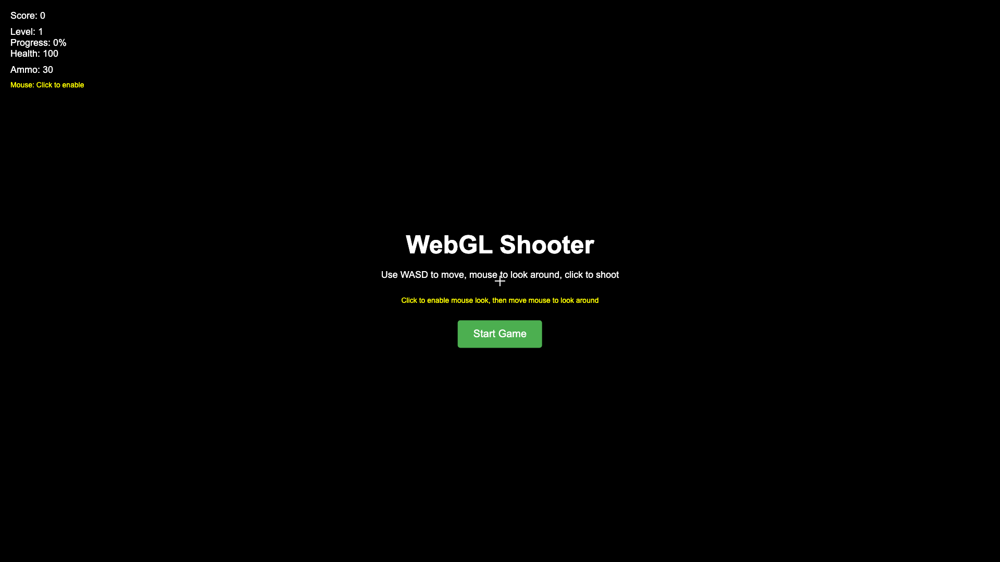
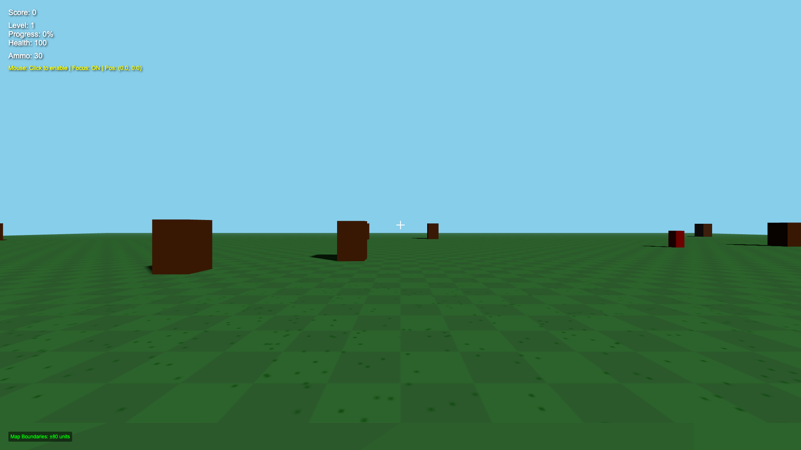
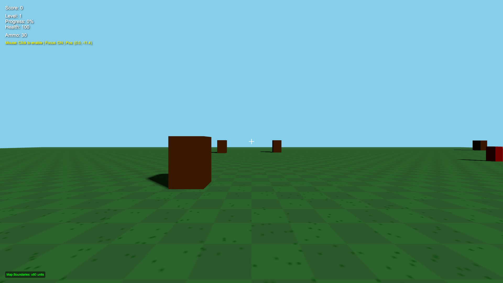

# WebGL Shooter Game

A modern browser-based first-person shooter game built with Three.js and WebGL. Features smooth 3D graphics, responsive controls, and comprehensive test coverage.

## 🎮 [Play Now](https://devoria.github.io/webgl-shooter/)

**Live Demo:** [https://devoria.github.io/webgl-shooter/](https://devoria.github.io/webgl-shooter/)

## 📸 Screenshots

### Start Screen


### Gameplay


### Active Gameplay


## 🎮 Features

- **First-Person Shooter Gameplay**: Move with WASD, look around with mouse, shoot with clicks
- **3D Graphics**: Built with Three.js for smooth WebGL rendering
- **Enemy AI**: Intelligent enemies that patrol, chase, and attack the player
- **Physics**: Realistic bullet physics and collision detection
- **Audio**: Dynamic sound effects using Web Audio API
- **Responsive UI**: Real-time score, health, and ammo display
- **Crosshair**: Visual aiming assistance
- **Game States**: Start screen, gameplay, and game over states

## 🚀 Getting Started

### Prerequisites

- Node.js (v14 or higher)
- Modern web browser with WebGL support

### Installation

1. Clone the repository:
```bash
git clone <repository-url>
cd shooter
```

2. Install dependencies:
```bash
npm install
```

3. Start the development server:
```bash
npm run dev
```

4. Open your browser and navigate to `http://localhost:3000`

### Building for Production

```bash
npm run build
```

The built files will be in the `dist` directory.

## 🎯 How to Play

1. **Start the Game**: Click the "Start Game" button
2. **Movement**: Use WASD keys to move around
3. **Look Around**: Move your mouse to look around (click to lock mouse)
4. **Shoot**: Click to shoot at enemies
5. **Objective**: Survive as long as possible and score points by defeating enemies

### Controls

- **W/A/S/D**: Move forward/left/backward/right
- **Mouse**: Look around
- **Left Click**: Shoot
- **ESC**: Pause (if implemented)

## 🏗️ Project Structure

```
shooter/
├── src/
│   ├── game/
│   │   ├── Game.js          # Main game engine
│   │   ├── Player.js        # Player character
│   │   ├── Enemy.js         # Enemy AI
│   │   ├── Bullet.js        # Projectile physics
│   │   └── CollisionManager.js # Collision detection
│   ├── input/
│   │   └── InputManager.js  # Keyboard and mouse input
│   ├── audio/
│   │   └── AudioManager.js  # Sound effects
│   ├── ui/
│   │   └── UIManager.js     # User interface
│   ├── test/                # Test files
│   └── main.js              # Application entry point
├── index.html               # Main HTML file
├── package.json             # Dependencies and scripts
├── vite.config.js           # Build configuration
└── README.md               # This file
```

## 🧪 Testing

The project includes comprehensive test coverage for all major components.

### Running Tests

```bash
# Run all tests
npm test

# Run tests in watch mode
npm run test:watch

# Run tests with coverage
npm run test:coverage
```

### Test Coverage

- **Game Engine**: Core game loop, collision detection, enemy spawning
- **Player**: Movement, rotation, damage handling
- **Enemy**: AI behavior, state management, damage system
- **Bullet**: Physics, lifetime management, visual effects
- **Input Manager**: Keyboard and mouse input handling
- **Audio Manager**: Sound effect generation and playback
- **UI Manager**: Interface updates and state management

## 🛠️ Technology Stack

- **Three.js**: 3D graphics and WebGL rendering
- **Vite**: Fast development server and build tool
- **Jest**: Testing framework
- **Web Audio API**: Dynamic sound generation
- **Pointer Lock API**: Mouse control for FPS gameplay

## 🎨 Graphics Features

- **Real-time 3D Rendering**: Smooth 60fps gameplay
- **Dynamic Lighting**: Ambient and directional lighting
- **Shadows**: Real-time shadow mapping
- **Fog Effects**: Atmospheric depth perception
- **Particle Effects**: Bullet trails and visual feedback

## 🔊 Audio Features

- **Dynamic Sound Generation**: Procedural audio using Web Audio API
- **Contextual Audio**: Different sounds for shooting, hits, and empty ammo
- **Volume Control**: Adjustable master volume
- **Mute Support**: Toggle audio on/off

## 🔧 Development

### Code Style

The project follows modern JavaScript conventions:
- ES6+ syntax
- Modular architecture
- Comprehensive error handling
- Performance optimization

### Adding New Features

1. **New Game Objects**: Extend the base classes in `src/game/`
2. **New Input Methods**: Add to `InputManager.js`
3. **New Audio**: Extend `AudioManager.js`
4. **New UI Elements**: Update `UIManager.js`

### Performance Optimization

- Efficient collision detection
- Object pooling for bullets
- Optimized rendering pipeline
- Memory management for large numbers of objects

## 🐛 Troubleshooting

### Common Issues

1. **Game doesn't start**: Check browser console for WebGL support
2. **No sound**: Ensure browser allows audio context creation
3. **Poor performance**: Reduce graphics quality or check hardware acceleration
4. **Mouse not working**: Click to enable pointer lock

### Browser Compatibility

- Chrome 60+
- Firefox 55+
- Safari 12+
- Edge 79+

## 📝 License

This project is licensed under the MIT License - see the LICENSE file for details.

## 🤝 Contributing

1. Fork the repository
2. Create a feature branch
3. Make your changes
4. Add tests for new functionality
5. Run the test suite
6. Submit a pull request

## 📊 Performance Metrics

- **Target FPS**: 60
- **Memory Usage**: < 100MB
- **Load Time**: < 3 seconds
- **Network**: < 2MB initial download

## 🎯 Future Enhancements

- [ ] Multiplayer support
- [ ] Different weapon types
- [ ] Power-ups and upgrades
- [ ] Level progression
- [ ] Mobile support
- [ ] VR compatibility
- [ ] Custom maps
- [ ] Leaderboards

## 📞 Support

For questions or issues, please open an issue on GitHub or contact the development team. 